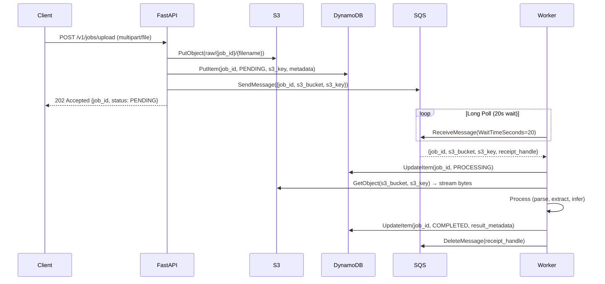

# Enterprise AI Platform — Phase 1 & 2 Architecture Guide

> **Purpose**: End-to-end reference for the async document ingestion pipeline (Phases 1–2). Written for onboarding, code reviews, and system-design interviews.
>
> **Status**: ✅ Phase 1 (Async Worker Layer) + Phase 2 (S3 Ingestion) — **Complete**

---

## 1. The Big Picture: What Problem Are We Solving?

### The Naive (Synchronous) Approach
```
Client → API → [Process 10MB PDF for 30–120s] → Response
```
**Why this fails in production:**
- **Timeouts** — API gateways / load balancers kill connections at ~30s
- **Thread starvation** — One long request blocks a worker thread; 10 concurrent uploads = 10 stuck threads
- **OOM crashes** — Large files loaded fully into RAM; concurrent uploads exhaust memory

### The Production-Grade (Async) Approach
```
Client → API → S3 (stream) → DynamoDB (ticket) → SQS (notification) → 202 Accepted
                                                              ↓
Worker ← SQS (poll) ← DynamoDB (PROCESSING) ← S3 (stream) ← Process → COMPLETED
```
**Result**: API returns in **<100ms**; heavy lifting happens in isolated, horizontally-scalable workers.

---

## 2. Real-World Analogy: The High-End Restaurant

| Role | System Component | Responsibility |
|------|------------------|----------------|
| **Customer** | API Client | Uploads a document (places an order) |
| **Waiter** | FastAPI (`POST /v1/jobs/upload`) | Receives file, stores in fridge, writes ticket, hangs ticket on rail, hands buzzer (job_id) |
| **Walk-in Fridge** | **Amazon S3** | Holds heavy binary blobs (PDFs, images) — cheap, durable, unlimited |
| **Order Board** | **Amazon DynamoDB** | Single-digit-ms key-value store tracking every job's lifecycle (`PENDING` → `PROCESSING` → `COMPLETED`/`FAILED`) |
| **Kitchen Rail** | **Amazon SQS** | Durable, ordered message queue; absorbs traffic spikes; delivers tickets to chefs |
| **Line Chef** | **Background Worker** (`worker.py`) | Polls rail, claims ticket, cooks (processes), updates board, clears ticket |

> **Key insight**: The waiter *never cooks*. The chef *never talks to customers*. Decoupling = resilience + horizontal scale.

---

## 3. Technology Stack (Plain English)

| Tool | What It Is | Why We Use It |
|------|------------|---------------|
| **Docker & Docker Compose** | Container orchestration | Identical local/CI/prod environments; one command spins up everything |
| **LocalStack** | Local AWS mock (S3, DynamoDB, SQS, etc.) | Zero cloud cost, zero network latency, full AWS SDK compatibility |
| **AWS CDK (Python)** | Infrastructure as Code | Version-controlled, reproducible infrastructure; no ClickOps |
| **FastAPI** | Async Python web framework | Native `async`/`await`, auto OpenAPI docs, Pydantic validation |
| **python-multipart** | Multipart form parser | Required for `UploadFile`; without it FastAPI raises `RuntimeError` |
| **Amazon S3** | Object storage | Offloads large blobs from DB; 5TB/object, virtually unlimited |
| **Amazon DynamoDB** | Serverless NoSQL key-value | Sub-ms latency, pay-per-request, perfect for job metadata |
| **Amazon SQS** | Managed message queue | Durable buffer between API and workers; visibility timeout = auto-retry on crash |

---

## 4. File Journey: End-to-End Flow



### Step-by-Step

| Step | Actor | Action | Artifact |
|------|-------|--------|----------|
| 1 | Client | `POST /v1/jobs/upload` with file | HTTP request |
| 2 | API | Generate `job_id = uuid4()` | `str` |
| 3 | API | Stream upload to S3: `raw/{job_id}/{filename}` | S3 object |
| 4 | API | Write DynamoDB item: `job_id`, `PENDING`, `s3_key`, `filename`, `content_type`, `created_at` | DB record |
| 5 | API | Push SQS message: `{job_id, s3_bucket, s3_key, task_payload}` | Queue message |
| 6 | API | Return `202 Accepted` + `JobResponse` | JSON |
| 7 | Worker | Long-poll SQS (20s wait, 1 msg at a time) | Message |
| 8 | Worker | Parse & validate message body | `JobMessage` |
| 9 | Worker | `UpdateItem → PROCESSING` | DB update |
| 10 | Worker | Stream `GetObject` from S3 into memory | `bytes` |
| 11 | Worker | **Process** (Phase 2: sleep 2s; Phase 3: Bedrock LLM) | Result |
| 12 | Worker | `UpdateItem → COMPLETED` + result metadata | DB update |
| 13 | Worker | `DeleteMessage` from SQS | Queue cleanup |

---

## 5. Deep-Dive Code Breakdown

### 5.1 Infrastructure: `infra/cdk_stack.py`

```python
class AiPlatformInfraStack(Stack):
    def __init__(self, scope, construct_id, **kwargs):
        super().__init__(scope, construct_id, **kwargs)

        # Names from env (with sensible defaults)
        table_name  = os.getenv("DYNAMODB_TABLE_NAME", "platform_jobs")
        queue_name  = os.getenv("AWS_SQS_QUEUE_NAME", "platform-job-queue")
        bucket_name = os.getenv("AWS_S3_BUCKET_NAME", "platform-document-ingestion-storage")

        # 1️⃣ DynamoDB — Job state table
        self.jobs_table = dynamodb.Table(
            self, "PlatformJobsTable",
            table_name=table_name,
            partition_key=dynamodb.Attribute(name="job_id", type=dynamodb.AttributeType.STRING),
            billing_mode=dynamodb.BillingMode.PAY_PER_REQUEST,
            removal_policy=RemovalPolicy.DESTROY,  # Dev-friendly cleanup
        )

        # 2️⃣ SQS — Ingestion queue
        self.jobs_queue = sqs.Queue(
            self, "PlatformJobsQueue",
            queue_name=queue_name,
            removal_policy=RemovalPolicy.DESTROY,
            # VisibilityTimeout defaults to 30s — perfect for worker crash recovery
        )

        # 3️⃣ S3 — Document storage bucket
        self.document_bucket = s3.Bucket(
            self, "PlatformDocumentStorageBucket",
            bucket_name=bucket_name,
            removal_policy=RemovalPolicy.DESTROY,
            auto_delete_objects=True,  # Clean up objects on stack destroy
        )
```

**Key design decisions:**
- `PAY_PER_REQUEST` → no capacity planning, scales to zero cost when idle
- `RemovalPolicy.DESTROY` + `auto_delete_objects` → `cdk destroy` cleans everything (dev only!)
- All names configurable via env vars → same stack deploys to dev/staging/prod with different names

---

### 5.2 API Layer: `app/api/v1_jobs.py`

```python
router = APIRouter(prefix="/v1/jobs", tags=["Job Lifecycle Engine"])

@router.post("", status_code=status.HTTP_202_ACCEPTED, response_model=JobResponse)
def trigger_batch_job(request: JobCreateRequest):
    """JSON payload ingestion (Phase 1)."""
    if not request.payloads:
        raise HTTPException(400, "Payload collection cannot be empty.")
    return get_job_repo().create(request)


@router.post("/upload", status_code=status.HTTP_202_ACCEPTED, response_model=JobResponse)
async def trigger_file_job(file: UploadFile = File(...)):
    """Multipart file ingestion (Phase 2)."""
    if not file.filename:
        raise HTTPException(400, "Uploaded file must have a valid filename.")

    file_bytes = await file.read()  # Stream into memory (fine for <10MB; Phase 3: stream to S3 directly)
    return get_job_repo().create_from_file(
        filename=file.filename,
        file_content=file_bytes,
        content_type=file.content_type or "application/octet-stream",
    )
```

**Why `202 Accepted`?**  
HTTP semantics: *"The request has been accepted for processing, but the processing has not been completed."* Client polls `GET /v1/jobs/{job_id}` for status.

---

### 5.3 Core Schemas: `app/core/schemas.py`

```python
class JobStatus(str, Enum):
    PENDING     = "pending"
    PROCESSING  = "processing"
    COMPLETED   = "completed"
    FAILED      = "failed"


class JobCreateRequest(BaseModel):
    payloads: List[str] = Field(..., description="Text payloads for async processing")
    metadata: Optional[Dict[str, Any]] = None


class JobResponse(BaseModel):
    job_id: str
    status: JobStatus
    created_at: float
    updated_at: float
    error_message: Optional[str] = None
```

---

### 5.4 Repository (Business Logic): `app/infrastructure/repository.py`

```python
class DynamoJobRepository:
    def __init__(self):
        self.table = get_dynamodb_resource().Table(settings.DYNAMODB_TABLE_NAME)
        self.sqs    = get_sqs_resource()
        self.s3     = get_s3_client()
        self.queue_url = self.sqs.get_queue_url(QueueName=settings.AWS_SQS_QUEUE_NAME)["QueueUrl"]
        self.bucket   = settings.AWS_S3_BUCKET_NAME

    # ── Phase 1: JSON payload ──────────────────────────────────────
    def create(self, request: JobCreateRequest) -> JobResponse:
        job_id = str(uuid.uuid4())
        now = time.time()

        item = {
            "job_id": job_id,
            "status": JobStatus.PENDING.value,
            "payloads": request.payloads,
            "metadata": request.metadata or {},
            "created_at": now,
            "updated_at": now,
        }
        self.table.put_item(Item=item)

        # Fire-and-forget to SQS
        self.sqs_client.send_message(
            QueueUrl=self.queue_url,
            MessageBody=json.dumps({
                "job_id": job_id,
                "task_payload": request.payloads,
                "metadata": request.metadata or {},
            }),
        )
        return JobResponse(job_id=job_id, status=JobStatus.PENDING, created_at=now, updated_at=now)

    # ── Phase 2: File upload ───────────────────────────────────────
    def create_from_file(self, filename: str, file_content: bytes, content_type: str) -> JobResponse:
        job_id = str(uuid.uuid4())
        now = time.time()
        s3_key = f"raw/{job_id}/{filename}"

        # 1. Stream to S3
        self.s3.put_object(
            Bucket=self.bucket,
            Key=s3_key,
            Body=file_content,
            ContentType=content_type,
        )

        # 2. Record in DynamoDB
        item = {
            "job_id": job_id,
            "status": JobStatus.PENDING.value,
            "filename": filename,
            "content_type": content_type,
            "s3_key": s3_key,
            "metadata": {"s3_bucket": self.bucket, "s3_key": s3_key},
            "created_at": now,
            "updated_at": now,
        }
        self.table.put_item(Item=item)

        # 3. Notify worker via SQS
        self.sqs_client.send_message(
            QueueUrl=self.queue_url,
            MessageBody=json.dumps({
                "job_id": job_id,
                "s3_bucket": self.bucket,
                "s3_key": s3_key,
                "task_payload": [filename],  # Back-compat for worker parser
                "metadata": {"filename": filename, "content_type": content_type},
            }),
        )
        return JobResponse(job_id=job_id, status=JobStatus.PENDING, created_at=now, updated_at=now)

    # ── Shared: Status lookup ──────────────────────────────────────
    def get_job(self, job_id: str) -> Optional[Dict]:
        resp = self.table.get_item(Key={"job_id": job_id})
        return resp.get("Item")
```

---

### 5.5 Worker: `worker.py`

```python
def process_job_payload(message_body: Dict) -> Tuple[str, Dict]:
    """
    Parse SQS message → extract S3 coords → stream object → do work → return result_metadata.
    Returns (job_id, result_metadata).
    """
    job_id   = message_body["job_id"]
    s3_bucket = message_body["s3_bucket"]
    s3_key    = message_body["s3_key"]

    # Stream download (memory-efficient for large files)
    obj = s3_client.get_object(Bucket=s3_bucket, Key=s3_key)
    file_bytes = obj["Body"].read()

    # ── PHASE 2: Simulated work (Phase 3 = Bedrock call here) ──
    time.sleep(2)  # Placeholder for PDF parsing / LLM inference

    result_metadata = {
        "processed_bytes": len(file_bytes),
        "s3_key": s3_key,
        "completed_at": time.time(),
    }
    return job_id, result_metadata


def update_job_status(job_id: str, status: JobStatus, result_metadata: Optional[Dict] = None, error: Optional[str] = None):
    """Single source of truth for status transitions."""
    update_expr = "SET #s = :status, updated_at = :now"
    expr_names  = {"#s": "status"}  # 'status' is reserved in DynamoDB
    expr_values = {":status": status.value, ":now": time.time()}

    if result_metadata:
        update_expr += ", result_metadata = :meta"
        expr_values[":meta"] = result_metadata
    if error:
        update_expr += ", error_message = :err"
        expr_values[":err"] = error

    table.update_item(
        Key={"job_id": job_id},
        UpdateExpression=update_expr,
        ExpressionAttributeNames=expr_names,
        ExpressionAttributeValues=expr_values,
    )


def start_worker():
    print("🚀 Worker Active | Polling SQS queue for incoming jobs...")
    queue_url = sqs_client.get_queue_url(QueueName=settings.AWS_SQS_QUEUE_NAME)["QueueUrl"]

    while True:
        # Long-poll: wait up to 20s for a message (saves CPU + cost)
        resp = sqs_client.receive_message(
            QueueUrl=queue_url,
            MaxNumberOfMessages=1,
            WaitTimeSeconds=20,
            VisibilityTimeout=30,  # If worker crashes, message reappears after 30s
        )

        for msg in resp.get("Messages", []):
            receipt = msg["ReceiptHandle"]
            try:
                body = json.loads(msg["Body"])
                job_id = body["job_id"]

                print(f"📋 Processing job_id: {job_id}")

                # 1️⃣ Mark PROCESSING
                update_job_status(job_id, JobStatus.PROCESSING)

                # 2️⃣ Do the work
                job_id, result_meta = process_job_payload(body)

                # 3️⃣ Mark COMPLETED
                update_job_status(job_id, JobStatus.COMPLETED, result_metadata=result_meta)
                print(f"✅ Completed job_id: {job_id}")

            except Exception as e:
                # Mark FAILED — message NOT deleted → visibility timeout → retry → DLQ (Phase 4)
                job_id = body.get("job_id", "unknown")
                update_job_status(job_id, JobStatus.FAILED, error=str(e))
                print(f"❌ Failed job_id: {job_id} | {e}")
                continue  # Skip delete → message returns to queue after visibility timeout

            # 4️⃣ Success → remove from queue
            sqs_client.delete_message(QueueUrl=queue_url, ReceiptHandle=receipt)


if __name__ == "__main__":
    start_worker()
```

**Resilience patterns baked in:**
- **Visibility timeout (30s)** → Auto-retry on worker crash
- **Delete only on success** → At-least-once delivery
- **Error captured in DynamoDB** → `FAILED` status + `error_message` for debugging
- **Long-poll (20s)** → Near-zero empty-receive cost

---

## 6. Configuration & Shared Clients

### `app/config.py` — Single Source of Truth
```python
class Settings(BaseSettings):
    ENVIRONMENT: str = "local"
    AWS_REGION: str = "us-east-1"
    AWS_ENDPOINT_URL: Optional[str] = None          # LocalStack endpoint
    AWS_ACCESS_KEY_ID: Optional[str] = None
    AWS_SECRET_ACCESS_KEY: Optional[str] = None
    DYNAMODB_TABLE_NAME: str = "platform_jobs"
    AWS_SQS_QUEUE_NAME: str = "platform-job-queue"
    AWS_S3_BUCKET_NAME: str = "platform-document-ingestion-storage"

    model_config = SettingsConfigDict(env_file=".env", extra="ignore")

settings = Settings()  # Singleton
```

### `app/infrastructure/aws/client.py` — Consistent Boto3 Factories
```python
def _get_boto3_kwargs() -> Dict:
    kwargs = {"region_name": settings.AWS_REGION, "endpoint_url": settings.AWS_ENDPOINT_URL}
    if settings.ENVIRONMENT == "local":
        kwargs["aws_access_key_id"] = settings.AWS_ACCESS_KEY_ID or "mock_key"
        kwargs["aws_secret_access_key"] = settings.AWS_SECRET_ACCESS_KEY or "mock_secret"
    return kwargs


def get_dynamodb_resource(): return boto3.resource("dynamodb", **_get_boto3_kwargs())
def get_sqs_resource():      return boto3.resource("sqs",      **_get_boto3_kwargs())
def get_s3_client():         return boto3.client("s3",         **_get_boto3_kwargs())
def get_s3_resource():       return boto3.resource("s3",       **_get_boto3_kwargs())
```

**Why this matters:** One config switch (`ENVIRONMENT=local` vs `prod`) flips between LocalStack and real AWS — zero code changes.

---

## 7. Docker Compose: `docker-compose.yml`

```yaml
services:
  localstack:
    image: localstack/localstack:latest
    container_name: localstack_main
    ports:
      - "127.0.0.1:4566:4566"
      - "127.0.0.1:4510-4559:4510-4559"
    environment:
      - AWS_DEFAULT_REGION=us-east-1
      - EDGE_PORT=4566
    volumes:
      - localstack_data:/var/lib/localstack
      - /var/run/docker.sock:/var/run/docker.sock
    networks: [platform_network]

  api_platform:
    build:
      context: .
      dockerfile: Dockerfile          # Single Dockerfile for both API & worker
    container_name: ai_platform_app
    ports: ["127.0.0.1:8000:8000"]
    environment:
      - AWS_ENDPOINT_URL=http://localstack:4566
      - AWS_REGION=us-east-1
      - ENVIRONMENT=local
    depends_on: [localstack]
    volumes: [".:/workspace"]
    networks: [platform_network]

  api_worker:
    build:
      context: .
      dockerfile: Dockerfile          # Same image, different entrypoint
    container_name: ai_platform_worker
    command: python worker.py
    environment:
      - AWS_ENDPOINT_URL=http://localstack:4566
      - AWS_REGION=us-east-1
      - ENVIRONMENT=local
    depends_on: [localstack]
    volumes: [".:/workspace"]
    networks: [platform_network]

  localstack_gui:
    image: aaronshaf/dynamodb-admin:latest
    container_name: localstack_dashboard_ui
    ports: ["127.0.0.1:8001:8001"]
    environment:
      - DYNAMO_ENDPOINT=http://localstack:4566
      - AWS_REGION=us-east-1
      - AWS_ACCESS_KEY_ID=mock_id
      - AWS_SECRET_ACCESS_KEY=mock_secret
    depends_on: [localstack]
    networks: [platform_network]

networks:
  platform_network:
    name: platform_architecture_net

volumes:
  localstack_data:
```

> **Note**: Both API and worker use the same `Dockerfile` (multi-stage or single-stage). The worker container overrides `command: python worker.py`.

---

## 8. System Design Trade-offs (Interview Cheat Sheet)

| Decision | Why | Alternative & Why Not |
|----------|-----|----------------------|
| **HTTP 202 Accepted** | Honest semantics: "accepted for processing" ≠ "done" | `200 OK` lies to client; `201 Created` implies resource exists |
| **SQS Long Poll (20s)** | Eliminates empty-receive CPU spin; costs ~$0.01/month | Short poll (1s) = 86K req/day = wasted $ + latency |
| **S3 + DynamoDB separate** | S3 for blobs (unlimited, cheap); DynamoDB for metadata (fast, queryable) | Putting PDFs in DynamoDB hits 400KB item limit + high RCU/WCU |
| **Delete SQS *after* success** | Crash mid-work → visibility timeout expires → message redelivered → retry | Delete before work → crash = lost job forever |
| **CDK (Python) for IaC** | Version-controlled, reviewable, testable, diffable | Console ClickOps = drift, no audit trail, not reproducible |
| **Single Dockerfile, dual entrypoints** | Shared deps, smaller image, consistent runtime | Separate `Dockerfile.worker` = divergence risk |

---

## 9. System Design Interview Q&A

### Q1: "10,000 users upload files at the same second. What happens?"
> **API**: FastAPI streams each upload to S3 + writes tiny DynamoDB item + sends SQS message. All non-blocking. Handles 10K req/s easily.  
> **SQS**: Absorbs all 10K messages instantly (virtually unlimited throughput).  
> **Workers**: Process at their own pace. Add more worker containers (ECS Fargate / K8s HPA) to drain queue faster. Zero impact on API latency.

### Q2: "Worker crashes halfway through a 200-page PDF. What happens?"
> SQS **visibility timeout** (30s default) protects the message. Worker never calls `DeleteMessage`. After 30s, message becomes visible again. Healthy worker picks it up, reprocesses from start. Idempotency key = `job_id` (DynamoDB upsert is idempotent).

### Q3: "Why SQS over Redis/Celery?"
| | SQS | Redis + Celery |
|--|-----|----------------|
| **Durability** | Replicated across 3 AZs | In-memory (unless AOF/RDB + replicas) |
| **Ops** | Zero broker management | Run/maintain Redis cluster |
| **IAM** | Native AWS permissions | Custom auth |
| **Cost** | $0.40/million requests | EC2 + Redis instance hours |
| **Backpressure** | Built-in (queue depth metrics) | Custom |

### Q4: "How do you handle duplicate processing?"
> **At-least-once delivery** is SQS standard. Deduplication via `job_id` as DynamoDB primary key: `PutItem` with same `job_id` overwrites (idempotent). Worker checks current status before processing (optional optimization).

### Q5: "How would you add priority processing?"
> **Option A**: Separate priority queue + priority workers.  
> **Option B**: SQS FIFO queue with `MessageGroupId` = priority tier.  
> **Option C**: Priority field in message; workers peek + re-queue (complex, not recommended).

---

## 10. Debugging & Inspection Survival Guide

### 10.1 DynamoDB Admin UI
```bash
open http://localhost:8001
# Browse items, watch status transitions in real time
```

### 10.2 S3 via AWS CLI (LocalStack)
```bash
# List all objects
aws --endpoint-url=http://localhost:4566 s3 ls s3://platform-document-ingestion-storage/ --recursive

# Download a file
aws --endpoint-url=http://localhost:4566 s3 cp s3://platform-document-ingestion-storage/raw/<JOB_ID>/<FILENAME>.pdf ./local.pdf
```

### 10.3 S3 via Browser (Direct)
```
http://localhost:4566/platform-document-ingestion-storage/raw/<JOB_ID>/<FILENAME>.pdf
```

### 10.4 Worker Logs
```bash
docker compose logs -f ai_platform_worker
```

### 10.5 API Health & Docs
```bash
curl http://localhost:8000/health
open http://localhost:8000/docs  # Swagger UI
```

### 10.6 Submit a Test Upload
```bash
curl -X POST http://localhost:8000/v1/jobs/upload \
  -F "file=@./sample.pdf" \
  -H "accept: application/json"
# → {"job_id": "...", "status": "pending", "created_at": ..., "updated_at": ...}
```

---

## 11. Current Implementation Status

| Phase | Feature | Status | Location |
|-------|---------|--------|----------|
| **1** | Async worker layer (SQS + DynamoDB) | ✅ Done | `worker.py`, `repository.py`, `cdk_stack.py` |
| **1** | JSON payload endpoint (`POST /v1/jobs`) | ✅ Done | `v1_jobs.py::trigger_batch_job` |
| **2** | S3 document ingestion bucket | ✅ Done | `cdk_stack.py`, `config.py` |
| **2** | Multipart upload endpoint (`POST /v1/jobs/upload`) | ✅ Done | `v1_jobs.py::trigger_file_job` |
| **2** | S3 key pattern `raw/{job_id}/{filename}` | ✅ Done | `repository.py::create_from_file` |
| **2** | Worker streams from S3 | ✅ Done | `worker.py::process_job_payload` |
| **2** | File metadata in DynamoDB | ✅ Done | `metadata` field with `s3_bucket`, `s3_key` |
| **3** | **Bedrock / LLM integration** | 🔲 Planned | — |
| **4** | **Dead-letter queue (DLQ)** | 🔲 Planned | — |
| **4** | **Retry policy / max receives** | 🔲 Planned | — |
| **4** | **Structured logging / metrics / tracing** | 🔲 Planned | — |

---

## 12. Next Steps (Phase 3 & 4 Roadmap)

### Phase 3: AI Intelligence Engine (Bedrock)
1. Add `boto3.client("bedrock-runtime")` factory in `client.py`
2. Create `app/ai/bedrock_client.py` with prompt templates
3. Replace `time.sleep(2)` in `worker.py` with actual inference call
4. Store structured LLM output in `result_metadata` (JSON-serializable)
5. Add model config via `Settings` (model ID, temperature, max tokens)

### Phase 4: Production Resilience
1. **CDK**: Add `platform-job-dlq` queue + `redrive_policy` on main queue (`maxReceiveCount=3`)
2. **Worker**: On `FAILED` after max retries, publish to DLQ (or let SQS auto-DLQ)
3. **Observability**: Structured JSON logs → CloudWatch / Loki; Prometheus metrics (`jobs_processed_total`, `job_duration_seconds`); OpenTelemetry traces
4. **Idempotency**: Add `processed_at` guard in worker to skip re-processing completed jobs

---

## 13. File Index (Quick Reference)

```
enterprise_ai_platform/
├── infra/
│   └── cdk_stack.py              # CDK: DynamoDB + SQS + S3
├── app/
│   ├── api/
│   │   └── v1_jobs.py            # POST /v1/jobs, POST /v1/jobs/upload
│   ├── config.py                 # Pydantic Settings (env-driven)
│   ├── core/
│   │   └── schemas.py            # Pydantic models (JobStatus, JobResponse, ...)
│   ├── infrastructure/
│   │   ├── aws/
│   │   │   └── client.py         # Shared boto3 resource/client factories
│   │   └── repository.py         # DynamoJobRepository (all business logic)
├── worker.py                     # Long-poll SQS → process → update DB
├── docker-compose.yml            # 4-service local stack
├── Dockerfile                    # Shared API + worker image
├── requirements.txt              # Python deps
└── docs/
    └── PHASE1_2_Archguide.md     # ← You are here
```

---

*Document maintained alongside code. Update this file when architecture evolves.*